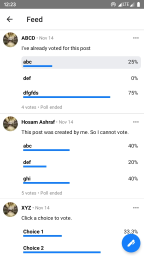
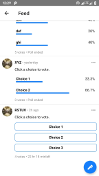
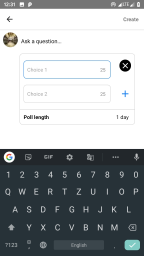
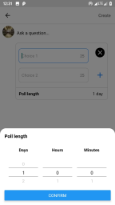

# react-native-twitter-poll
Twitter poll implemented using React Native

<b>Instructions to run the application</b>
* Download the code.
* Add the folder into your project.
* Install the required packages.
* Add the navigator in index.js to your main navigator. 
* Run the code.

<b>Screenshots</b>
  

